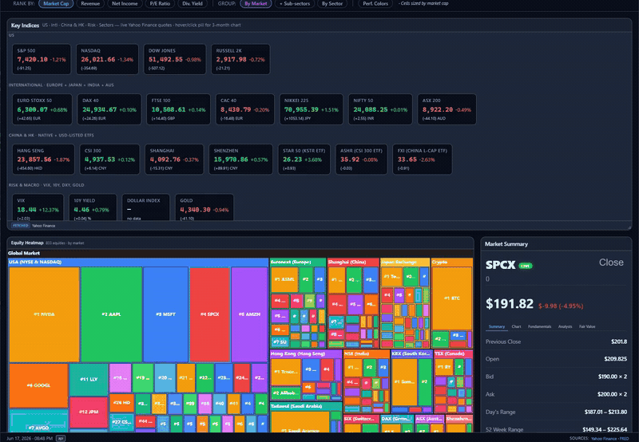

# Global Market Hub

A comprehensive multi-market financial dashboard built with React 18 + Vite 5. Covers 21 market views (17 financial dashboards + IMF + World Bank + BLS + EIA + Census) with unified "one-look" dashboards, live data from Yahoo Finance, FRED, CoinGecko, and more. Includes a 350+ stock global equity heatmap with historical playback.



## 🚀 Getting Started

```bash
# 1. install
npm install
cd server && npm install && cd ..

# 2. configure API keys (interactive — creates .env from .env.example)
npm run setup

# 3. launch backend + Vite
npm start            # → http://localhost:5173

# 4. verify all panels bind (screenshots + bound/empty report)
npm run test:validate
```

That's it. Dashboards auto-fetch on first load — no need to click refresh.

**API keys** — all free, instant signup, all stored in `.env` (gitignored). Skip any and the matching panels show a "Data source temporarily unavailable" placeholder; the rest of the app keeps working.

| Key | Powers | Free signup |
|---|---|---|
| `FRED_API_KEY` | bonds, macro, credit, fx (DXY/REER), sentiment, real estate, insurance, calendar | https://fred.stlouisfed.org/docs/api/api_key.html |
| `EIA_API_KEY` | commodities supply/demand, eia tab | https://www.eia.gov/opendata/register.php |
| `BLS_API_KEY` | bls tab (optional — falls back to FRED if blank) | https://data.bls.gov/registrationEngine/ |

**Useful scripts**

| Command | What it does |
|---|---|
| `npm start` | Boots Express backend on a free port + Vite dev server on 5173 |
| `npm run setup` | Interactive `.env` walkthrough — prompts only for keys still blank |
| `npm run test:regress` | API-shape + UI smoke check — non-zero exit on regression |
| `npm run test:validate` | Playwright crawler — screenshots every tab, writes `test-results/validate.{md,json}` |
| `npm run test:audit` | Playwright spec for PENDING/empty panels (soft report, never fails) |
| `npm run test:coverage` | Strict per-panel coverage — registry-driven; **fails** when any registered panel goes empty or an unregistered panel appears. Source of truth: `tests/panel-registry.js`. |
| `npm run test:persist` | Drag → reload → verify layout persisted |
| `npm test` | Vitest unit suite (~380 tests) |

### Feature Roadmap

- **Stock Search** — Search and filter stocks by name, ticker, sector, and market cap. (Milestone 1)

**Documentation**

- [`docs/PANELS.md`](docs/PANELS.md) — every tab + every panel with purpose, data source, signal interpretation
- [`docs/DATA_PIPELINE.md`](docs/DATA_PIPELINE.md) — end-to-end pipeline diagram (external APIs → server routes → DataProvider → panels), caching strategy, cross-market enrichment
- [`docs/API_ENDPOINTS.md`](docs/API_ENDPOINTS.md) — current frontend endpoint map, Firebase Functions route aliases, RTDB snapshot coverage, and cross-market bindings
- [`docs/CHANGELOG.md`](docs/CHANGELOG.md) — user-visible dashboard/data-contract changes by date
- [`docs/SHARED_CACHE.md`](docs/SHARED_CACHE.md) — optional GCS shared market cache for Cloud Run
- After App Hosting deploys: `npm run postdeploy:warm` (route traffic + warm priority APIs)

**Troubleshooting** — if a tab still shows "PENDING" / "NO DATA" after a code change:
```bash
del server\datacache\*.json     # Windows
rm  server/datacache/*.json     # mac/linux
```
Caches survive 24h and can outlive a code change.

---

## Table of Contents

- [Markets](#markets)
- [Data Shown Per Market Tab](#data-shown-per-market-tab)
- [Unified Dashboard Architecture](#unified-dashboard-architecture)
- [App-Level Features](#app-level-features)
- [Infrastructure](#infrastructure)
- [Architecture](#architecture)
- [Data Provenance & Transparency](#data-provenance--transparency)
- [Global Equity Dashboard](#global-equity-dashboard)
- [Tech Stack](#tech-stack)
- [Getting Started](#getting-started)
- [Project Structure](#project-structure)
- [Contributing](#contributing)
- [Known Limitations](#known-limitations)
- [Notes](#notes)
- [Recent Updates](#recent-updates)

---


## Markets

### Market Tabs

| # | Market | Dashboard View | Accent | Live Data Sources |
|---|--------|----------------|--------|-------------------|
| 1 | **Equities** | Heatmap + Bar Race + List + Portfolio + Data Hub | Blue | Yahoo Finance (350+ stocks), Frankfurter FX |
| 2 | **Bonds** | Yield Curve (8 countries), Credit Spreads, Duration Ladder, Breakevens, History Charts | Green `#10b981` | FRED (9 US tenors, intl 10yr, IG/HY/EM spreads, TIPS breakevens, DGS10 252d) |
| 3 | **FX** | Rate Matrix, Carry Map, DXY Tracker, Top Movers | Amber `#f59e0b` | FRED (7 bilateral rates, DXY), Frankfurter API |
| 4 | **Derivatives** | Vol Surface (SPX), VIX Term Structure, Options Flow | Purple `#a78bfa` | Yahoo (VIX term, SPY/QQQ options), FRED (VIXCLS 252d) |
| 5 | **Real Estate** | Price Index, REIT Screen, Affordability, Cap Rates, Mortgage Rates | Orange `#f97316` | Yahoo (REITs, VNQ), FRED (Case-Shiller, HOUST, MSPUS, BIS prices) |
| 6 | **Insurance** | Cat Bond Spreads, Combined Ratio, Reserve Adequacy, Reinsurance | Sky Blue `#0ea5e9` | Yahoo (PGR/ALL/TRV/HIG quarterlies), FRED (HY OAS 252d) † |
| 7 | **Commodities** | Price Dashboard, Futures Curve, Sector Heatmap, Supply/Demand, COT, strategic materials, regime/energy/curve boards | Gold `#ca8a04` | Yahoo futures, FRED, EIA, USDA, Census Trade, curated USGS-style strategic-mineral metadata |
| 8 | **Global Macro** | Unified Scorecard (12 countries), Growth/Inflation, Central Bank Rates, Debt Monitor | Teal `#14b8a6` | World Bank, FRED (policy rates) |
| 9 | **Equity+** | Sector Rotation, Factor Rankings, Earnings Watch, Short Interest | Indigo `#6366f1` | Yahoo Finance (12 sector ETFs, quoteSummary, chart) |
| 10 | **Crypto** | Market Overview, Fear & Greed, DeFi TVL, Funding Rates, On-Chain Metrics | Amber `#f59e0b` | CoinGecko (top 20 + global), DeFiLlama (TVL), Alternative.me (F&G), Bybit (funding), mempool.space (on-chain) |
| 11 | **Credit** | IG/HY Spreads, EM Bonds, Loan Market, Default Watch | Cyan `#06b6d4` | FRED (5 spread series), Yahoo (LQD, HYG, EMB, JNK, BKLN, MUB) † |
| 12 | **Sentiment** | Fear & Greed, CFTC Positioning, Risk Dashboard, Cross-Asset Returns | Violet `#7c3aed` | Alternative.me (252d), FRED (VIX, HY, YC), CFTC Socrata, Yahoo (8 ETFs) |
| 13 | **Calendar** | Economic Calendar, Central Banks, Earnings Season, Key Releases | Rose `#f43f5e` | FRED (releases/dates), Yahoo (calendarEvents, 30 tickers) |
| 14 | **Alerts** | Active Alerts, Alert Rules | Red `#ef4444` | Aggregates 6 market endpoints, 8 anomaly rules (VIX spike, curve inversion, HY stress, F&G extremes, BTC/Gold/DXY moves) |
| 15 | **Watchlist** | My Tickers, My Metrics | Gold `#eab308` | Yahoo Finance (live quotes per ticker), cross-market metric shortcuts |

### Infrastructure Tabs

| # | Tab | View | Accent | Data Sources |
|---|-----|------|--------|--------------|
| 16 | **Analytics** | API Usage, Endpoint Metrics, Data Freshness, Rate Limits, Cache Files | Slate `#94a3b8` | Server-side endpoint tracker, rate limit counters, file cache metadata |

### Institutional Data Tabs

| # | Market | Dashboard View | Accent | Live Data Sources |
|---|--------|----------------|--------|-------------------|
| 17 | **IMF** | Scorecard, GDP Growth, Inflation, International Reserves, COFER Currency Shares | Blue `#42a5f5` | IMF WEO (12 countries, GDP/inflation/debt/unemployment/current account), IMF IFS (reserves), IMF COFER (currency share of FX reserves) |
| 18 | **World Bank** | World Development Indicators, GDP Growth Trends, GDP per Capita vs Growth Scatter, Trade Openness | Green `#4ade80` | World Bank WDI API (10 countries, GDP growth, GDP/capita, inflation, trade, population) |
| 19 | **BLS** | Labor Market KPIs (unemployment, participation, payrolls, earnings, hours), Prices (CPI, PPI), 3-Year Trend Sparklines | Blue `#42a5f5` | BLS Public API (10 series: unemployment, labor participation, employment-pop ratio, nonfarm payrolls, avg hourly earnings, avg weekly hours, CPI, PPI, job openings, unemployed persons) |
| 20 | **EIA** | US Electricity Prices by Sector (residential/commercial/industrial), Consumption (sales & revenue), CO₂ Emissions by Sector, 3-Year Price Trends | Orange `#ffa726` | EIA API (electricity retail sales/prices by sector, CO₂ emissions by sector) |
| 21 | **Census** | Housing & Construction (housing starts, building permits, new home sales, construction spending), Trade & Consumption (retail sales, durable goods, trade balance), 3-Year Monthly Sparklines | Purple `#ab47bc` | US Census Bureau via FRED (7 series: HOUST, PERMIT, HSN1F, TTLCONS, RSAFS, DGORDER, BOPGSTB) |

> † Partial synthetic data — some panels use algorithmically generated or hardcoded values where no free API source exists. See KNOWN_LIMITATIONS.md for details.

---

## Data Shown Per Market Tab

### 1. Equities
**Sidebar:**
- Key Metrics: S&P 500, Nasdaq 100, Dow Jones, Russell 2000 prices with % change
- Market Stats: Total market cap, advancers/decliners, new highs/lows
- VIX Level: Current value with fear/greed indicator
- Fed Funds: Current rate, next meeting expectation

**Main Panels:**
- **Heatmap**: 350+ global stocks colored by % change, sized by market cap, grouped by sector/region
- **Bar Race**: Animated top 30 stocks with historical playback
- **List View**: Sortable table with ticker, name, sector, region, market cap, % change
- **Detail Panel**: On-click expansion with chart, fundamentals, analysts, fair value

### 2. Bonds
**Sidebar:**
- Yield Curve: US 3M, 2Y, 5Y, 10Y, 30Y with steepest/flattest indicators
- Spread Indicators: 2s10s, 10s3s, 5s30s spread values
- Credit Spreads: IG OAS, HY OAS, EM OAS current values
- Breakevens: 5Y, 10Y inflation expectations
- Fed Funds: Current rate + futures curve

**Main Panels:**
- **Yield Curve**: Multi-country comparison (US, DE, JP, GB, IT, FR, etc.)
- **Credit Spreads**: 12-month IG/HY/EM/BBB spread history
- **Spread History**: 2s10s, 10s3s, 5s30s time series (252 days)
- **CPI Components**: All Items, Core, Food, Energy YoY% (60 months)
- **Debt-to-GDP**: US federal debt trajectory (20 years quarterly)
- **Real Yields**: TIPS 5Y/10Y history
- **Breakevens**: 5Y, 10Y, 5Y5Y forward inflation expectations

### 3. FX
**Sidebar:**
- Key Pairs: EUR/USD, USD/JPY, GBP/USD, USD/CHF with % change
- Movers: Top 12 currency movers vs USD
- Averages: G10 avg, EM avg change
- Rate Differentials: Fed vs ECB, BOE, BOJ spreads
- COT Positioning: Net speculative positions as % of OI

**Main Panels:**
- **Top Movers Table**: Currency, % change, 1W sparkline
- **DXY Chart**: Dollar Index 1-year history
- **COT Positioning Chart**: Net positioning history for major pairs (52 weeks)
- **Currency Correlation Matrix**: 30-day rolling correlation heatmap (G10)
- **REER Chart**: Real Effective Exchange Rates (US, EU, JP, GB, CN)
- **Rate Differentials Table**: Central bank rate spreads

### 4. Derivatives
**Sidebar:**
- VIX: Spot, VVIX, contango/backwardation %
- Volatility: Put/Call ratio, ATM 1M IV, VIX percentile
- Term Spread: 1M-3M VIX spread with state indicator
- SKEW Index: Tail risk premium with interpretation
- Gamma Exposure: Total GEX, call/put gamma, net gamma

**Main Panels:**
- **VIX Term Structure**: 9D, 1M, 3M, 6M futures vs previous close
- **VIX History**: 252-day spot VIX chart
- **SKEW Index History**: 252-day SKEW with neutral reference line
- **Vol Surface Heatmap**: SPX implied vol by strike/expiry
- **Options Flow**: Recent large block trades
- **Vol Premium**: ATM IV vs realized vol spread
- **Gamma Exposure Table**: Total, call, put, net gamma ($B)

### 5. Real Estate
**Sidebar:**
- Price Index: Case-Shiller National with YoY change
- Mortgage Rates: 30Y fixed, 15Y fixed with weekly change
- REIT Performance: VNQ price and dividend yield with % change

**Main Panels:**
- **Case-Shiller Chart**: National + major metros (SF, NYC, LA, Miami, Chicago)
- **Home Prices Table**: Regional Case-Shiller indices with YoY change
- **Foreclosure & Delinquency Chart**: 12-month history
- **MBA Applications Chart**: Purchase vs refi index
- **CRE Delinquencies Chart**: Commercial RE loan delinquencies
- **REIT Screen Table**: Top REITs with sector, dividend yield, P/FFO, YTD return
- **Affordability Index**: Median home price, median income, price-to-income ratio, mortgage-to-income ratio, 30Y mortgage rate, YoY price change (FRED MSPUS / MEHOINUSA672N)
- **Housing Supply**: Housing starts, building permits, months' supply, active listings (FRED HOUST / PERMIT / MSACSR / ACTLISCOUUS)

### 6. Insurance
**Sidebar:**
- Combined Ratio: Industry average with profitability indicator
- Reinsurers: PGR, ALL, TRV, HIG with % change
- HY OAS Spread: Current value

**Main Panels:**
- **HY OAS History Chart**: 252-day high-yield spread
- **Combined Ratio by Line**: Auto, home, commercial, etc. profitability *(no free API; algorithmically generated)*
- **Reinsurance Rates**: By category (property, casualty, etc.) *(no free API; hardcoded reference values)*
- **Reserve Adequacy Table**: Insurer reserves vs required *(no free API; algorithmically generated)*
- **Cat Bond Spreads**: ILS market spreads *(no free API; algorithmically generated)*
- **Natural Cat Losses Chart**: NPORCT annual losses
- **Industry Combined Ratio History**: Quarterly trend with 100% breakeven line *(no free API; algorithmically generated)*
- **Sector ETFs**: KIE with 52-week range

### 7. Commodities
**Sidebar:**
- Key Prices: Gold, WTI Oil, Natural Gas with 1D change
- Ratios & ETFs: Gold/Oil ratio, DBC ETF % change, contango %
- Positioning: COT net long/short for major commodities

**Main Panels:**
- **Commodity Prices**: Yahoo futures table/chart for energy, precious metals, copper, grains, softs, and livestock
- **Futures Curve**: WTI and gold term structure, seasonality, and DXY/WTI overlay
- **Sector Performance**: Energy / metals / agriculture / livestock heatmap with PPI context
- **Supply & Demand**: EIA crude stocks, gas storage, crude production, gasoline/distillate stocks, and gold fallback
- **COT Positioning**: CFTC net speculative positioning, enriched from the Sentiment endpoint
- **Commodity FX**: CAD, AUD, NOK, BRL, CLP, ZAR where FX context is available
- **US Ag Commodity Prices**: USDA NASS prices for core ag commodities
- **Petroleum & Natural Gas**: EIA gasoline, Henry Hub, crude stocks
- **US Trade Balance**: Census trade balance by bloc
- **Physical Supply Pressure**: Combined EIA/USDA/Census physical-market read
- **Strategic Materials Periodic Grid**: periodic-table-style critical minerals and materials
- **Criticality Leaderboard**: criticality and import-reliance ranking
- **Battery Supply Chain**: lithium, graphite, nickel, cobalt, manganese, copper, vanadium
- **Precious Metals Complex**: gold/silver/platinum/palladium and PGM context
- **Commodity Regime Dashboard**: inflationary, disinflationary, growth-led, supply-shock, safe-haven regime read
- **Energy Stack**: crude, Brent, natural gas, heating oil, crude inventory context
- **Curve Structure Board**: contango/backwardation summary
- **Strategic Material Detail**: click a periodic tile for material-specific criticality, producer/processor, proxy, and uses
- **Material-to-Sector Exposure Matrix**: EV/grid/defense/chips/solar/nuclear exposure map

### 8. Global Macro
**Sidebar:**
- GDP Growth: US, EU, China, Japan real GDP YoY
- Inflation: CPI by country with central bank target comparison
- Central Bank Rates: Fed, ECB, BOE, BOK, SNB, RBA, BOC, BOJ
- Debt/GDP: Government debt ratios

**Main Panels:**
- **Country Scorecards**: 12 countries with growth, inflation, rates, currency, equity
- **GDP Growth Chart**: Multi-country comparison
- **Inflation Chart**: CPI trends by country
- **Policy Rate Chart**: Central bank rates history
- **Debt Monitor**: Government debt-to-GDP trends
- **Currency Strength Matrix**: Relative performance

### 9. Equities+ (Deep Dive)
**Sidebar:**
- Sector Performance: 11 GICS sectors with % change
- Factor Returns: Value, growth, momentum, quality, low vol
- Earnings Surprise: Latest beat/miss rates
- Short Interest: Highest short interest stocks

**Main Panels:**
- **Sector Rotation Chart**: Performance heatmap by sector/time
- **Factor Rankings Table**: Factor exposures sorted by return
- **Earnings Calendar**: Upcoming earnings with expected surprise
- **Short Interest Table**: Highest short interest with days to cover
- **Institutional Ownership**: Top holders by stock
- **Insider Trading**: Recent insider buys/sells

### 10. Crypto
**Sidebar:**
- BTC/ETH: Price, 24h change, market dominance
- Market: Total cap, stablecoin cap, ETH gas
- Fear & Greed: Current value with classification

**Main Panels:**
- **Top Cryptos Table**: Top 20 by market cap with price, change
- **Fear & Greed Chart**: 252-day history with fear/greed thresholds
- **Funding Rates Table**: Bybit perp funding rates
- **Top Exchanges Table**: Volume by exchange
- **DeFi TVL by Chain**: Total value locked breakdown
- **On-Chain Metrics**: Network stats, hash rate, active addresses

### 11. Credit
**Sidebar:**
- Credit Spreads: IG OAS, HY OAS, EM spread with color coding
- Default Watch: Default rate, delinquency metrics
- Short-Term: Commercial paper rate

**Main Panels:**
- **Credit Spreads Chart**: IG/HY 12-month history
- **Spread Summary Table**: IG, HY, EM, BBB current spreads
- **EM Spread History Chart**: EM sovereign spread
- **EM Yields Table**: Country 10Y yields *(no free API; hardcoded reference values)*
- **Commercial Paper Table**: AA 30-day rate, volume
- **CLO Tranches Table**: AAA/AA/A tranche yields *(no free API; algorithmically generated)*
- **Default Rates Table**: By category *(no free API; algorithmically generated)*
- **Delinquency Rates Table**: Consumer credit delinquencies

### 12. Sentiment
**Sidebar:**
- Fear & Greed: Current value with classification (Extreme Fear to Extreme Greed)
- Risk Metrics: VIX level, put/call ratio, HY spread
- Leverage: Margin debt, consumer credit

**Main Panels:**
- **Fear & Greed Chart**: 252-day history with fear/greed zones
- **Financial Stress Index Chart**: St. Louis FSI history
- **Cross-Asset Returns Table**: Equities, bonds, commodities, crypto % change
- **Risk Signals Table**: Multiple indicators with risk-on/risk-off classification
- **Leverage Metrics Table**: Margin debt, consumer credit values

### 13. Calendar
**Sidebar:**
- Today's Events: Economic releases, earnings
- This Week: Key dates summary

**Main Panels:**
- **Economic Calendar Table**: Date, time, event, consensus, previous, impact
- **Central Bank Meetings**: Upcoming FOMC, ECB, BOJ dates
- **Earnings Season**: High-profile earnings calendar
- **Key Releases**: CPI, NFP, GDP, FOMC highlights

### 14. Alerts
**Sidebar:**
- Active Alerts Count: Number of triggered alerts
- Last Check: When alerts were last evaluated

**Main Panels:**
- **Active Alerts Table**: Alert name, condition, current value, threshold, severity
- **Alert Rules Table**: All configured rules with enable/disable toggle

**Alert Rules (Default):**
1. VIX Spike: VIX > 30
2. Curve Inversion: 2s10s < 0
3. HY Stress: HY OAS > 400bps
4. Fear Extreme: F&G < 20
5. Greed Extreme: F&G > 80
6. BTC Move: BTC ±5% in 24h
7. Gold Move: Gold ±3% in 24h
8. DXY Move: DXY ±2% in 24h

### 15. Watchlist
**Sidebar:**
- Quick Metrics: VIX, DXY, 10Y Treasury, BTC, Gold, SPX, HY Spread, Fear & Greed shortcuts

**Main Panels:**
- **My Tickers**: Custom list of tickers with live quotes, add/remove functionality
- **My Metrics**: Shortcuts to key metrics across markets

### 16. Analytics
**Sidebar:**
- Cache Status: Cache file count, total size, oldest/newest entries

**Main Panels:**
- **API Usage**: Request counts per endpoint with success/failure ratios
- **Endpoint Metrics**: Response times, payload sizes, error rates per route
- **Data Freshness**: Last-fetch timestamps for all 20 market endpoints
- **Rate Limits**: Daily request counts vs caps for 13 free API sources
- **Cache Inventory**: List of cached files in `server/datacache/` with dates and sizes
- **Panel Trace Inspector**: Traces data flow from frontend panel → backend field → external API for every panel in 13 markets. Shows field presence, shape, `_sources` flags, and verdict (OK / NULL / MISSING / SHAPE / WARN). Includes `shapeCheck` validation that catches data-structure mismatches (e.g. history keyed by date instead of currency code). Select a market, expand any panel to see the full pipeline: render condition, backend source, external API dependencies, JSON samples, and a diagnostic verdict.
- **Provenance Audit**: Cross-references `_sources` with FRED series for all endpoints. Date-aware: audit a specific historical RTDB snapshot or latest. Click "Verify" on individual FRED series to confirm data exists and matches.
- **API Health Diagnostics**: Probes structural integrity and latency of all endpoints. Admin can run live diagnostics that write a report to RTDB.

### 17. IMF
**Main Panels:**
- **IMF Scorecard**: 12-country table (US, Euro Area, UK, Japan, Canada, China, India, Brazil, South Korea, Australia, Mexico, Sweden) with GDP growth, inflation, unemployment, GDP/capita, current account, gov debt, gov revenue, investment, population, intl reserves. Click row for detail panel.
- **GDP Growth**: Multi-country bar chart of real GDP growth (WEO forecasts)
- **Inflation**: Multi-country CPI inflation comparison chart
- **International Reserves**: Total reserves including gold by country (IMF IFS)
- **COFER Currency Shares**: USD, EUR, JPY, GBP, CNY, other shares of global FX reserves (IMF COFER)

### 18. World Bank
**Main Panels:**
- **World Development Indicators**: 10-country scorecard (US, UK, DE, FR, JP, IT, CA, CN, IN, BR) with GDP growth, GDP/capita, inflation, trade % of GDP, population. Click row for detail panel.
- **GDP Growth Trends**: Time-series chart of GDP growth by country
- **GDP per Capita vs Growth**: Scatter plot of development level vs growth rate
- **Trade Openness**: Trade as % of GDP by country (imports + exports / GDP)

### 19. BLS
**Main Panels:**
- **Key Labor Market Indicators**: KPI grid — Unemployment Rate, Labor Force Participation, Employment-Population Ratio, Nonfarm Payrolls, Avg Hourly Earnings, Avg Weekly Hours, CPI (All Urban), PPI (Final Demand), Job Openings, Unemployed Persons. Each with latest value, MoM % change, and period label.
- **Trends (3-Year)**: Sparkline charts for each series showing 36 months of history

### 20. EIA
**Main Panels:**
- **US Electricity Retail Prices**: KPI cards for Residential, Commercial, Industrial electricity prices (¢/kWh) with % change
- **Electricity Consumption**: KPI cards for each sector showing sales (B kWh) and revenue ($M)
- **Price Trends (3-Year Monthly)**: Sparkline charts for each sector's price history
- **CO₂ Emissions by Sector**: Table with sector-level emissions data (residential, commercial, industrial, transportation, electric power)

### 21. Census
**Main Panels:**
- **Housing & Construction**: KPI cards — Housing Starts, Building Permits, New Home Sales, Construction Spending — with MoM % change
- **Trade & Consumption**: KPI cards — Retail Sales, Durable Goods Orders, Trade Balance — with MoM % change
- **Trends (3-Year Monthly)**: Sparkline charts for all 7 series (housing starts, permits, new home sales, construction spending, retail sales, durable goods, trade balance)

## Unified Dashboard Architecture

All 21 markets use a **"one-look" unified dashboard** pattern — no more tab switching to see all data. Each dashboard shows:

- **KPI Strip** — 4-6 key metrics at the top (accent-colored values)
- **Bento Grid** — Charts and tables in draggable/resizable `react-grid-layout` panels with `BentoWrapper`, layout persisted via `localStorage`
- **Compact Tables** — Mini-tables for rates, spreads, metrics
- **Historical Charts** — FRED/Yahoo time series where available

This consolidation reduces cognitive load and enables instant cross-comparison across asset classes.

## App-Level Features

- **Panel Health Indicators** — each market tab's dropdown shows real-time status dots: green (data loaded), red (no data/unavailable), orange (stale), grey (not yet visited). Status is cached from DOM scans and market data at initialization, so hovering shows accurate status without clicking first.
- **AppLogger** — structured event logging for AI agent consumption. Captures data fetches, panel health, user interactions, and errors. Stored in `localStorage` (key: `app-log`) and exposed via `window.__APP_LOG` for Playwright access.
- **Dark / Light Theme** — toggle in the tab bar, persisted to localStorage
- **PNG Export** — capture any market view as a high-res PNG screenshot
- **CSV / JSON Export** — download raw market data in either format
- **Global Search** — search across all 21 markets with keyboard navigation
- **Multi-Monitor Mode** — pop out any market into its own browser window
- **Currency Picker** — display values in USD, EUR, GBP, JPY, CNY, and 5 more (currency conversion currently applied in Equities only; other markets coming)
- **URL Routing** — `?market=bonds` in the URL, shareable links, browser back/forward
- **Tab Persistence** — last-viewed market restored on page refresh
- **Auto-Refresh** — toggle 5-minute polling for all market data
- **Toast Notifications** — visual feedback for exports, errors, and data events
- **Keyboard Shortcuts** — `1`–`9`/`0` switch tabs, arrows prev/next, `Ctrl+E` export, `Ctrl+K` search
- **Print-Friendly** — `@media print` stylesheet hides chrome, maximizes content
- **Loading Skeletons** — shimmer placeholders during lazy-load and data fetch
- **Error Boundaries** — per-market crash isolation with retry button

## Infrastructure

- **Backend Modularization** — `server/index.js` is a thin orchestrator (130 lines), 25 route files in `server/routes/`, 5 lib modules
- **HTTP Cache Headers** — `Cache-Control` on all API routes (15min market data, 5min health/status)
- **Fetch Retry** — `fetchWithRetry` with exponential backoff + AbortController timeout in all data hooks
- **Rate Limit Monitoring** — `/api/rate-limits` endpoint tracking 13 free API sources
- **Responsive CSS** — breakpoints at 1024px, 768px, and 480px with progressive grid collapse
- **Accessibility** — ARIA roles/labels on all tab bars, skip-to-content link, combobox search
- **Docker Deployment** — multi-stage `Dockerfile`, `docker-compose.yml`, SPA catch-all
- **Bundle Analysis** — `rollup-plugin-visualizer` generates `dist/bundle-stats.html` on build

## Architecture

### Frontend
- **React 18** with Vite 5 (HMR, fast builds)
- **DataProvider** — centralized data pipeline in `src/hub/DataProvider.jsx`. Fetches all 20 market endpoints on demand (▶ button click), manages state via `DataContext`. Market components consume data via `useMarketData(marketId)` — no independent fetches.
- **ECharts** via `echarts-for-react` — all charts use `animation: false`, `backgroundColor: 'transparent'`
- **react-grid-layout v2** — bento-box dashboards with draggable/resizable panels, layout persistence via `localStorage`
- **BentoWrapper** — shared component (`src/components/BentoWrapper.jsx`) with `storageKey` prop, `.bento-panel-title-row` drag handle, `.bento-panel-content` drag cancel, responsive breakpoints. Each market tab uses `BentoWrapper` with its own `storageKey` (e.g., `"commodities-layout"`, `"bonds-layout"`, `"macro-layout"`)
- **CSS Variables** — 12 semantic variables in `:root` / `[data-theme]` for theming
- **ThemeContext** — `useTheme()` hook provides `{ theme, colors, toggle }`
- **ToastContext** — `useToast()` hook for notification management

### Backend
- **Express 4** on port 3001, modularized into 25 route files + 5 lib modules
- **yahoo-finance2** — quotes, options chains, historical prices, calendar events
- **FRED API** — 40+ economic series
- **Two-tier cache** — in-memory `node-cache` (15 min TTL) wraps file-based daily cache in `server/datacache/`
- **Fallback** — on error, serves latest cached data with `isCurrent: false`

### Centralized Data Pipeline
All 20 market endpoints are fetched by a single `DataProvider` component at the app level. Alerts are computed client-side from 6 already-fetched endpoints (sentiment, bonds, credit, crypto, commodities, FX) — no extra network calls. The centralized pipeline:

> **Why 21 tabs but 20 fetches?** Alerts (tab 14) is federated — computed client-side from 6 other endpoints rather than fetched independently. The Analytics tab (tab 16) reads server-side metrics rather than calling a dedicated data endpoint.

1. **On demand only** — Data is NOT fetched on page load or tab switch. The user clicks the ▶ button in the tab bar to fetch all markets. Auto-refresh (5-min polling) is toggled separately.
2. **Batched concurrency** — 20 endpoints fetched in batches of 4 with 300ms delays between batches.
3. **Federated markets** — Alerts are computed client-side from 6 already-fetched endpoints — no extra network calls.
4. **FX server-side** — Frankfurter API (spot rates, 1W/1M changes, sparklines) and CFTC COT data are fetched server-side in `/api/fx`, not from the browser.
5. **State persistence** — Fetched data persists across tab switches. Switching tabs shows cached data instantly.

### Data Hooks (Legacy — Per-Market)
Each market previously had its own `useXxxData` hook that independently fetched its endpoint. These have been consolidated into the centralized `DataProvider`. The per-market hooks still exist in `src/markets/*/data/` but are no longer called from Market components — they serve as reference for data shape and server-response mapping.

## Data Provenance & Transparency

Every data point in the app is traceable to its source. Two provenance components are wired into every market dashboard:

### DataFooter (per panel)
- Click the FETCHED/NO DATA/PENDING badge at the bottom of any panel
- Expands a popover showing:
  - **API Call History** — timestamped log of every fetch (URL, HTTP status, duration)
  - **Data Sources Received** — each source key with ✓/✗ received status
  - **FRED Series** — for FRED-backed sources, shows Series Page and Fetch JSON links with API key
  - **Verify** — click to confirm data exists at the original API

### MetricValue (per data point)
- Click any major metric value (e.g., EUR/USD rate, VIX level, 10Y yield)
- Expands a popover showing:
  - Current value, source name, series ID
  - Local timestamp with UTC offset (down to seconds)
  - FRED Series Page link
  - Fetch JSON link (includes API key for direct browser verification)

### Provenance Audit (Analytics tab)
- Click "Run Audit" to fetch all 12+ market endpoints
- Cross-references `_sources` from each endpoint response
- Shows received/missing status per source
- Lists FRED series IDs with Series Page and Fetch JSON links
- "Verify" button calls FRED API directly to confirm data exists

### Data Provenance Rules
- **Never** display mock or fabricated data — show "—" or empty state if no real data
- **Never** label REST API data as "Live" — use FETCHED for successful fetches, NO DATA or PENDING otherwise
- All timestamps show seconds precision with UTC offset (YYYY-MM-DD HH:MM:SS UTC+XX:XX)
- Popovers use click-to-open (not hover), auto-position to avoid viewport overflow
- All links inside popovers are clickable
- Data does NOT auto-fetch on page load or tab visit — only fetches when the ▶ button is clicked or when auto-refresh is toggled On

## Global Equity Dashboard

### Visualization Modes
- **Heatmap** — ECharts treemap across 350+ real global stocks with zoom, pan, drill-down
- **Bar Race** — Animated top-30 horizontal bar chart with real-time sort, colored by region or sector
- **Time Travel** — Drag timeline scrubber from 2020 to today with IndexedDB snapshot playback at 1x/2x/4x speed
- **List View** — sortable table with sector chips, region indicators, snapshot % change

### Ranking & Grouping
- Rank by Market Cap, Revenue, Net Income, P/E, or Dividend Yield
- Group by Market, Sector-in-Market, or Global Sector
- 20-color rank palette or green/red performance coloring

### Time Travel
- Drag timeline scrubber from 2020 to today
- Play/pause button toggles animated playback at 1x/2x/4x speed
- Reset button returns to live data
- Market caps rescale to historical closing prices (via IndexedDB snapshots)
- 40+ annotated macro events (Fed hikes, earnings, crises) shown as colored dots
- Bar Race view updates dynamically as dates change

### Detail Panel
- Click any stock in heatmap for live Yahoo Finance data
- Tabs: Chart (1yr area), Fundamentals, Analysts, Fair Value
- Macro indicators from FRED (M1, M2, CPI, Fed Funds, unemployment, GDP)
- Live FX rates via Frankfurter API

## Tech Stack

| Layer | Technology |
|---|---|
| Frontend | React 18, Vite 5, ECharts (`echarts-for-react`), `html2canvas`, PapaParse |
| Backend | Firebase Functions v2, Express 4, `yahoo-finance2`, `node-cache` |
| Data | Firebase RTDB snapshots, Yahoo Finance, FRED API, CoinGecko, DeFiLlama, Bybit, CFTC Socrata, EIA, USDA NASS, IMF WEO/IFS/COFER, World Bank WDI, BLS, US Census Bureau, Treasury Fiscal Data, BEA, ECB, OECD, Eurostat, mempool.space, Frankfurter |
| Styling | Plain CSS with CSS variables (dark/light themes), responsive breakpoints |
| Tests | Vitest 4, @testing-library/react — ~350 tests across 60+ files |
| Deploy | GitHub Pages frontend + Firebase Functions backend; Docker files remain for local/legacy workflows |

## Getting Started

### Panel Health Initialization

The panel health status dots in the market tab dropdown are pre-populated during app initialization:

1. **Market data fetch**: DataProvider fetches all 20 market endpoints on mount. As each fetch completes, `usePanelHealth` populates the cache with "ok" for all panels in that market.
2. **DOM scan**: When a market becomes active (tab clicked), its panels render. A `MutationObserver` watches for `[data-panel-key]` attributes and captures the actual panel status (ok/null/stale) from the DOM content.
3. **Cache merge**: DOM-based status always takes precedence over market-data status. The cache is updated synchronously inside `useMemo`, so there's no timing gap between data load and status display.
4. **Hover access**: When hovering any tab, the dropdown reads from the cache — showing accurate status for visited markets and market-data status for unvisited ones.

This means hovering shows useful status dots **without needing to click each tab first**.

### 1. Install dependencies

```bash
npm install
cd server && npm install
```

### 2. Configure environment

Create a local `.env` file with the following keys (all free). Production values are configured as Firebase Function secrets and GitHub Actions variables:

- `FRED_API_KEY=your_key_here` — required for most markets. Get one at [fred.stlouisfed.org/docs/api/api_key.html](https://fred.stlouisfed.org/docs/api/api_key.html).
- `EIA_API_KEY=your_key_here` — required for the EIA (electricity, CO₂ emissions) and Commodities dashboards. Get one at [eia.gov/opendata](https://www.eia.gov/opendata/). Without it, the EIA route returns 503 and Commodities skips EIA-backed series.
- `BLS_API_KEY=your_key_here` — required for the BLS (labor market, prices) and Global Macro employment dashboards. Get one at [bls.gov/api_home.htm](https://www.bls.gov/api_home.htm). Without it, the BLS route returns 503 and Global Macro skips employment series.

### 3. Start the app

```bash
npm start           # Both frontend (5173) and backend (3001)
# Or separately:
npm run dev          # Frontend only
cd server && node index.js  # Backend only
```

Dashboards auto-hydrate from RTDB latest snapshots on first load. The top-bar play/refresh control is admin-only and triggers a live refresh through Firebase Functions.

### 4. Run tests

```bash
npx vitest run
```

### 5. Build for production

```bash
npm run build
# Bundle analysis at dist/bundle-stats.html
```

### 6. Docker deployment

```bash
docker-compose up --build   # http://localhost:3001
```

### 7. Deploy frontend to GitHub Pages + Firebase Functions backend (the live setup)

This app is a static SPA. When deployed to GitHub Pages (or any static host) it has **no local backend**, so all data must come from the Firebase Functions deployment.

**One-time setup (do this in the GitHub repo UI):**

1. Go to your repo → **Settings → Secrets and variables → Actions → Variables** (tab).
2. Add a new **Variable**:
   - Name: `VITE_API_BASE_URL`
   - Value: the root URL of your `api` Cloud Function. After running the deploy command below you will see it printed. Typical value for this project:
     ```
     https://us-central1-kfinance032926.cloudfunctions.net/api
     ```
   (If you ever change regions or use a custom domain / Cloud Run direct URL, just update this variable.)

**Deploy steps (run locally or via the workflow):**

```bash
# 1. Make sure your Firebase Functions are up to date and note the printed URL
firebase deploy --only functions

# 2. (Optional but recommended) Set the VITE_API_BASE_URL variable in the repo
#    (see "One-time setup" above). The GitHub Action will pick it up automatically.

# 3. Push to main (or use "Run workflow" from the Actions tab)
git push origin main
```

The workflow (`.github/workflows/deploy-pages.yml`) will:
- Build the Vite app (injecting `VITE_API_BASE_URL` if present)
- Deploy the `dist/` folder to GitHub Pages

After the Pages deployment finishes, hard-refresh the live site. All the previous 404s for `/api/*` should be gone because `DataProvider` and the other data layers now use the full external backend URL in production.

**Verifying the live backend from the browser:**

Open DevTools → Console. You should see lines like:
```
[DataProvider] → bonds
[DataProvider] ✓ bonds 200 ...
```

You can also call the health endpoint directly:
```
https://us-central1-kfinance032926.cloudfunctions.net/api/api/health
```

**Updating the backend URL later**

Just change the `VITE_API_BASE_URL` repository variable and re-run the Pages workflow (or push an empty commit). No code change required.

### 8. (Optional) Pre-fetch equity data

Downloads 5 years of history + fundamentals for 350+ tickers (~52 MB, ~21 min):

```bash
node scripts/fetch-universe.js
```

## Project Structure

```
src/
  hub/                          # Hub shell, routing, tab bar, theme, footer
    HubLayout.jsx               # Market routing + URL sync + exports + keyboard shortcuts
    DataProvider.jsx             # Central data pipeline — fetches all 20 endpoints, manages state via React context
    DataContext.jsx              # useMarketData(marketId) hook — market components consume data here
    MarketTabBar.jsx             # Tabs + search + theme + export + refresh + pop-out + currency
    markets.config.js            # Market definitions + search index (21 markets)
    ThemeContext.jsx            # Dark/light theme provider
    ToastContext.jsx            # Toast notification provider
    HubFooter.jsx               # Clock + cache status + data source attribution
    MarketSkeleton.jsx           # Shimmer loading placeholder
  hooks/
    useInterval.js               # Reusable polling interval hook
    useDataStatus.js              # Shared hook: fetchLog, isLive, lastUpdated, logFetch(), error handling
  markets/
    equities/                   # Global equity heatmap + all views
    bonds/                      # Unified dashboard (yield curve, spreads, breakevens)
    fx/                         # Unified dashboard (rate matrix, carry, movers)
    derivatives/                # Unified dashboard (vol surface, VIX term, options)
    realEstate/                 # Unified dashboard (price index, REIT, affordability)
    insurance/                  # Unified dashboard (cat bonds, combined ratio)
    commodities/                # Unified dashboard (prices, futures, COT)
    globalMacro/                # Unified dashboard (scorecard, growth, rates, debt)
    imf/                       # IMF dashboard (scorecard, growth/inflation, reserves, COFER)
    worldbank/                 # World Bank dashboard (scorecard, growth trends, development, trade)
    equitiesDeepDive/           # Unified dashboard (sectors, factors, earnings, shorts)
    crypto/                     # Unified dashboard (market, F&G, DeFi, funding)
    credit/                     # Unified dashboard (IG/HY spreads, EM, loans)
    sentiment/                  # Unified dashboard (F&G, CFTC, risk, returns)
    calendar/                   # Unified dashboard (economic, earnings, releases)
    bls/                        # BLS dashboard (labor market, prices, trends)
    eia/                        # EIA dashboard (electricity, emissions, energy)
    census/                     # Census dashboard (housing, trade, retail, durable goods)
    alerts/                     # Active alerts + alert rules
    watchlist/                  # My tickers + my metrics
    analytics/                  # API usage, endpoint metrics, data freshness, cache inventory
  components/                   # Shared: BentoWrapper, SafeECharts, DataFooter, MetricValue, HeatmapView, DetailPanel, Sidebar, etc.
  utils/                        # FX rates, fetchWithRetry, data helpers, constants
  __tests__/                    # ~350 tests across 60+ files
server/
  index.js                      # Express orchestrator (130 lines)
  routes/                       # 25 route modules (bonds, fx, crypto, etc.)
  dataSources/                    # Static fallback snapshots (WEO, IFS/COFER, sovereign ratings, commodity sources)
  lib/                          # 5 shared modules (cache, fetch, yahoo, stocks, rateLimits)
  datacache/                    # gitignored — daily JSON file cache
```

## Contributing

To add a new market view:
1. **Backend**: Create a new route in `server/routes/` to fetch and normalize data.
2. **Configuration**: Add the market definition and search metadata to `src/hub/markets.config.js`.
3. **Frontend**: Create a new market directory in `src/markets/` using the `BentoWrapper` component for the layout.
4. **Data Pipeline**: Ensure the new endpoint is included in the `DataProvider.jsx` fetch sequence.

## Known Limitations

See [KNOWN_LIMITATIONS.md](KNOWN_LIMITATIONS.md) for a full list of intentional constraints (mock/synthetic data policy, rate limits, caching caveats, required env vars, browser baseline, etc.).

## Notes

- `yahoo-finance2` is an unofficial scraper — for personal/educational use only
- `server/datacache/`, `data/stocks/`, and `prices/` are gitignored
- All markets show empty states ("—") when no real data is available instead of mock data
- FRED API key is free at [fred.stlouisfed.org/docs/api](https://fred.stlouisfed.org/docs/api/api_key.html)
- See [KNOWN_LIMITATIONS.md](KNOWN_LIMITATIONS.md) for detailed constraints and edge cases

## Recent Updates

See [`docs/CHANGELOG.md`](docs/CHANGELOG.md) for the human-readable change log and `git log` for exact commits.
