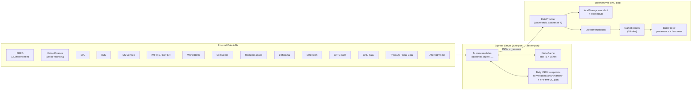
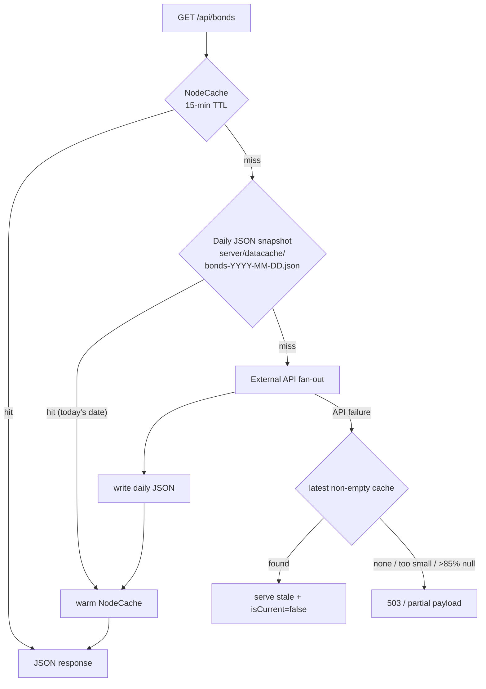
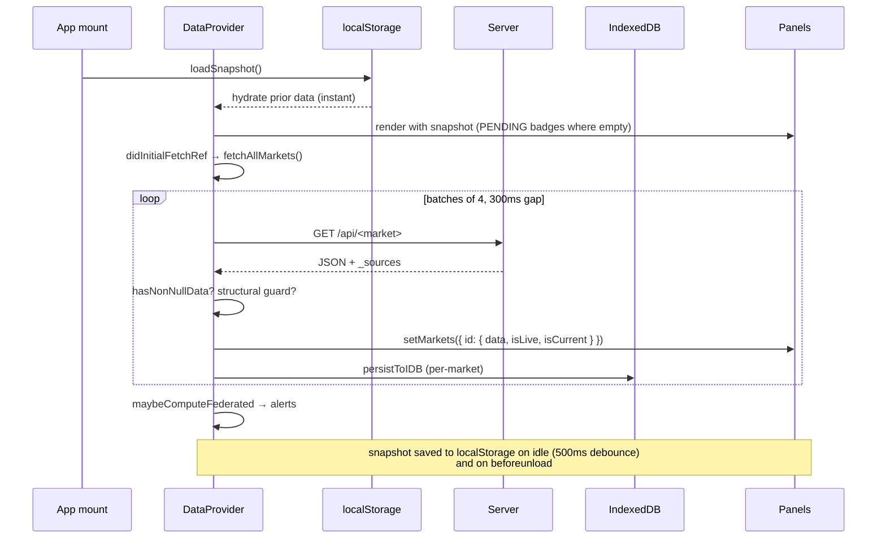
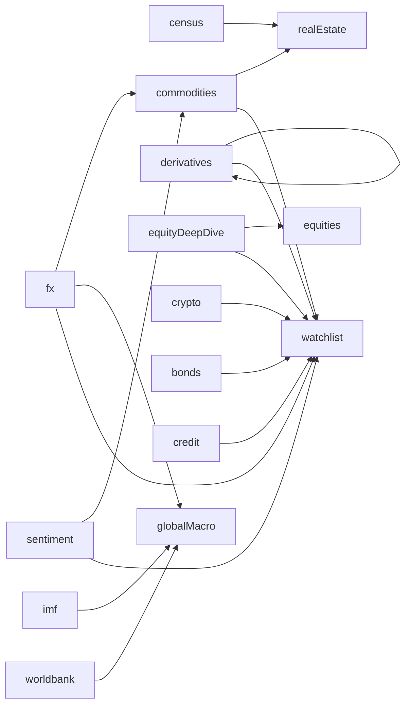

# Data Pipeline

How a number gets from a public-data API into a panel on the Global Market Hub.

This is the end-to-end picture: external APIs → server routes → caches → DataProvider →
`useMarketData` hook → market panel → DataFooter provenance. Read it once and the rest
of the codebase becomes self-explanatory.

---

## 1. The 30-second view



The whole system is **read-mostly and idempotent**. There is no DB, no auth, no
queue — just public APIs, two cache layers on the server, two cache layers in
the browser, and a fan-out fetcher that keeps the UI live.

---

## 2. External APIs (what we pull from)

| Source | Auth | Used by |
| --- | --- | --- |
| **FRED** (St. Louis Fed) | API key (`FRED_API_KEY`) | bonds, fx, credit, derivatives, sentiment, commodities, equityDeepDive, globalMacro, insurance, realEstate, calendar, macro |
| **Yahoo Finance** (yahoo-finance2) | none | equities, bonds (ETFs), fx, derivatives, realEstate (REITs), insurance, commodities (futures), equityDeepDive, credit (ETFs), sentiment (cross-asset returns), calendar (earnings) |
| **EIA** | API key (`EIA_API_KEY`) | eia, commodities (oil/gas) |
| **BLS** | API key (`BLS_API_KEY`) | bls, globalMacro (employment) |
| **US Census Bureau** | optional key | realEstate (housing/construction starts via FRED mirrors), census |
| **IMF IFS** | none | globalMacro (international reserves RAXFSFX) |
| **IMF COFER** | none | globalMacro (FX reserve currency shares) |
| **World Bank** | none | globalMacro (GDP, CPI, debt, trade openness) |
| **CoinGecko** | none | crypto |
| **Mempool.space** | none | crypto (BTC mempool, hashrate) |
| **DefiLlama** | none | crypto (TVL, stablecoins) |
| **Alternative.me** | none | crypto (Crypto F&G) |
| **Etherscan** | none / optional key | crypto (gas) |
| **CFTC COT** | none | sentiment (positioning), commodities (cross-market enrichment) |
| **CNN Fear & Greed** | none | sentiment |
| **Treasury Fiscal Data** | none | bonds (avg interest rates), calendar (auctions) |
| **CBOE / BIS** | derived from FRED | derivatives, globalMacro |

Per-source `items` are catalogued in `src/hub/dataSources.js` and surfaced in the
DataFooter on every panel.

---

## 3. Server routes (24 modules)

Mounted in `server/index.js`. All read-only HTTP:

```
/api/health                  — liveness probe (5-min Cache-Control)
/api/cache/status            — per-market freshness map
/api/rate-limits             — analytics dashboard data
/api/stocks                  — 825 equities (yahoo-finance2)
/api/macro                   — legacy macro (kept for transitional callers)
/api/bonds                   — yield curves, spreads, breakevens, mortgage
/api/derivatives             — VIX, SKEW, vol surface
/api/realEstate              — REITs, house prices, housing starts, retail
/api/insurance               — combined ratios, cat-bond proxy
/api/commodities             — legacy commodity payload
/api/commodities/v2          — current commodity payload (Yahoo + EIA + FRED)
/api/globalMacro             — scorecard, central banks, OECD CLI, COFER
/api/equityDeepDive          — sectors, factors, ERP, breadth, insiders
/api/crypto                  — coins, BTC dom, exchanges, defi, gas
/api/credit                  — IG/HY/EM/BBB/CCC, charge-offs, LSO C&I
/api/sentiment               — F&G, COT, cross-asset, VVIX
/api/calendar                — econ events, central banks, earnings, auctions
/api/fx                      — rates, DXY, REER, central-bank diffs
/api/institutional           — Form 13F (when available)
/api/analytics               — endpoint metrics for Analytics tab
/api/watchlist               — user watchlist stub (read)
/api/fred                    — generic FRED proxy
/api/imf                     — IMF IFS/COFER passthrough
/api/worldbank               — World Bank passthrough
/api/bls                     — BLS series passthrough
/api/eia                     — EIA series passthrough
/api/census                  — Census/FRED-mirror passthrough
/api/summary/:ticker         — single-ticker quote (yahoo-finance2)
/api/history/:ticker         — OHLC history
/api/snapshot                — bulk snapshot
```

Every route returns JSON shaped like:

```jsonc
{
  "lastUpdated": "2026-05-01 09:30:01",
  "fetchedOn":   "2026-05-01",
  "isLive":      true,
  "isCurrent":   true,
  // …market-specific keys…
  "_sources": [
    { "name": "FRED", "url": "https://fred.stlouisfed.org", "items": "…" },
    { "name": "Yahoo Finance", "url": "https://finance.yahoo.com", "items": "…" }
  ]
}
```

`_sources` is the provenance trail that DataFooter renders.

---

## 4. Server caching (two layers)



- **NodeCache** (in-memory, `server/index.js:89`): `stdTTL = 900` (15 min). Per-route
  keys. Cleared on server restart.
- **Daily JSON snapshot** (`server/lib/cache.js`): one file per market per day at
  `server/datacache/<market>-YYYY-MM-DD.json`. Survives restarts. Files older than
  7 days are pruned at startup (`cleanOldCaches`).
- **Anti-poisoning checks** in `cache.js`:
  - Refuse to read/write payloads `< 200 bytes` (likely empty/error response).
  - Refuse if `>85%` of leaf values are null/false/empty (failed cold-fetch).
  - These thresholds are why **deleting `server/datacache/*.json` after adding
    keys** is a documented troubleshooting step — bad caches written before keys
    were configured otherwise re-poison the in-memory layer.
- **HTTP `Cache-Control`** (`server/index.js:134`): `public, max-age=900,
  stale-while-revalidate=60` for market routes, `300` for `/api/health` and
  `/api/cache/status`.

### FRED throttling and retry

`server/lib/fetch.js` enforces:

- **120 calls/min sliding window** across the entire process. The 121st call
  sleeps until a slot opens.
- **Retry once on 5xx** with 750ms backoff (FRED only). 5xx during a cold-cache
  fan-out used to nuke whole panels when 20+ series fired simultaneously.

---

## 5. DataProvider — the client-side wave fetcher

`src/hub/DataProvider.jsx` is the single source of truth for every panel. It
runs once when the app mounts and again whenever the user clicks the manual
refresh button (or every 5 min if `autoRefresh=true`).



Key knobs (`src/hub/DataProvider.jsx`):

| Constant | Value | Why |
| --- | --- | --- |
| `FETCH_SETTINGS.timeout` | 30 000 ms | Cold FRED fan-outs can run >15s |
| `FETCH_SETTINGS.retries` | 1 | Avoid storming flaky upstreams |
| `FETCH_SETTINGS.batchConcurrency` | 4 | Below FRED 120/min ceiling at any realistic cadence |
| `FETCH_SETTINGS.batchDelayMs` | 300 | Smooths burst into rate-limit windows |
| `PRIORITY_MARKETS` | equities, bonds, fx, crypto, sentiment | (Defined for future ordering — currently fetches in `MARKET_ENDPOINTS` order.) |

### Live vs current vs empty

Two flags drive every panel's badge:

- **`isLive`** — the response passed `hasNonNullData` AND its market-specific
  `STRUCTURAL_GUARDS` check (e.g. bonds requires ≥3 yield-curve countries with
  data; commodities requires ≥2 COT entries; calendar requires events OR
  earnings OR central-bank meetings). If false, the panel renders "NO DATA" and
  the response is dropped.
- **`isCurrent`** — `fetchedOn === today`. False on stale-served caches, e.g.
  the server fell back to yesterday's snapshot because the upstream API failed.
  Panel still renders, but DataFooter labels the data as stale.

Both flags are surfaced through `useMarketData(id)` and consumed by every
DataFooter.

### Federated markets

Some "markets" don't have a backend route — they're computed on the client from
other markets' data:

| Federated id | Inputs | Computed by |
| --- | --- | --- |
| `alerts` | sentiment, bonds, credit, crypto, commodities, fx | `computeAlerts()` — runs 8 rule checks (VIX spike, curve inversion, HY widening, F&G extremes, BTC large move, gold rally, DXY shift). Recomputed every time any input lands. |

### Persistence layers (client)

1. **localStorage** (`hub-markets-snapshot-v1`) — slim per-market `{data,
   lastUpdated, fetchedOn, isLive, isCurrent, provenance}`. Saved on idle (500
   ms debounce) and `beforeunload`. Hydrated synchronously on mount so panels
   don't flash empty.
2. **IndexedDB** (`putSnapshot` / `snapshotDB.js`) — full-fidelity per-market
   per-day archive. Used by tools that backfill or compare across days.

---

## 6. Cross-market enrichment

Some panels need data from other markets. They consume it through
`useMarketData(otherMarketId)` rather than re-fetching.



Examples:

- **Commodities → COT panel** reads `sentiment.cotData` (CFTC positions live in
  the sentiment payload because that's where their primary use-case is — risk).
- **Commodities → currency overlay** reads `fx.fredFxRates` for CAD/AUD/NOK
  (commodity currencies).
- **Macro → International Reserves & COFER** read `imf.*` directly.
- **Macro → Trade Openness, GDP per capita** read `worldbank.countries`.
- **Real Estate → Housing & Construction & Trade** reads the `census` payload
  (which itself wraps FRED mirrors of Census series).
- **Equities → factor panels** read `equitiesDeepDive` for sector/factor breakdowns.

Cross-market reads have one consequence: a panel that depends on market B will
appear PENDING until B has resolved its wave fetch, even if A's own fetch
landed. The DataFooter on A still reports A's freshness — the dependent panel
shows its own empty state.

---

## 7. The hook layer — `useMarketData`

```js
const { data, isLoading, isLive, isCurrent, lastUpdated, fetchedOn, error,
        provenance, refetch } = useMarketData('bonds');
```

What it does on top of `DataContext`:

- **Currency conversion**: numeric values in `data` are run through the active
  currency converter in `CurrencyContext`. Strings, dates, and metadata pass
  through. Conversion is best-effort — series that aren't denominated in USD
  shouldn't be auto-converted, so panels currency-format at render time using
  `MetricValue`/`formatNumber` rather than relying on this layer.
- **Refetch**: `refetch()` re-runs only that market (not the full wave).

---

## 8. DataFooter — provenance contract

Every panel renders `<DataFooter market="…" />`. It pulls:

- `lastUpdated`, `fetchedOn`, `isLive`, `isCurrent` from `useMarketData(market)`
- `provenance.sources` (which is `data._sources` from the route response)
- A static fallback from `src/hub/dataSources.js` if the route didn't supply
  `_sources`

The footer is the user's contract: every number on screen has a clickable link
back to a public source. If a panel renders without one, it's a bug.

---

## 9. Validators (regression harness)

Two scripts under `scripts/` use the live server and a Playwright browser to
verify the pipeline end-to-end.

- **`npm run test:regress`** → `scripts/regress.mjs`
  - Reads `.server-port`, hits each `/api/<market>` directly, asserts response
    shape per `STRUCTURAL_GUARDS` mirror.
- **`npm run test:validate`** → `scripts/validate.mjs`
  - Spins up Playwright, mounts each tab, walks panels, asserts that no panel
    is stuck on PENDING/NO DATA when the server side has a live response.
- **`npm run test:audit`** → cache + freshness audit against
  `/api/cache/status`.
- **`npm run test:persist`** → drag-and-drop layout, reload, assert layout
  persisted (the BentoWrapper saves under all breakpoint keys with cols=12).

Validator output lands in `test-results/` and is gitignored.

---

## 10. The four-layer cache, summarized

| Layer | Where | TTL | Survives restart? | Purpose |
| --- | --- | --- | --- | --- |
| HTTP `Cache-Control` | response header | 15 min (`max-age=900`, SWR 60) | n/a | browser/proxy cache; reduces re-fetch on tab focus |
| NodeCache | server memory | 15 min | no | dedupe in-process fan-out |
| Daily JSON snapshot | `server/datacache/<market>-YYYY-MM-DD.json` | 1 day (rolling), pruned >7d | yes | restart-warm; stale-fallback when upstream APIs fail |
| Browser snapshot | localStorage + IndexedDB | indefinite | yes | first-paint hydration; cross-session continuity |

Mental model: **the server caches network calls, the browser caches the UI
state**. The two never share a key space.

---

## 11. End-to-end timing budget (cold-cache, all keys present)

| Phase | Budget |
| --- | --- |
| Browser → server `/api/bonds` (TTFB) | 50–500 ms (warm cache) |
| Server cold-fetch fan-out for one market | 2–10 s (FRED 20+ series, throttled) |
| Full DataProvider wave (24 routes, batch 4, 300 ms gap) | 8–25 s (cold) / <2 s (warm cache) |
| Per-panel render after data lands | <100 ms |

If a wave takes longer than 30 s the per-route 30 s timeout starts firing and
panels go red. That's the signal that either FRED is degraded, an API key is
wrong, or `server/datacache/` is poisoned and needs to be cleared.

---

## 12. Adding a new market — the checklist

1. **Backend route**: new file under `server/routes/<id>.js`, mount in
   `server/index.js`. Return `{ lastUpdated, fetchedOn, isLive, _sources, … }`.
   Use `readDailyCache`/`writeDailyCache` and `localCache`.
2. **Endpoint registry**: add to `MARKET_ENDPOINTS` in
   `src/hub/DataProvider.jsx`.
3. **Structural guard** (if the route's "non-empty" condition is non-trivial):
   add to `STRUCTURAL_GUARDS` in `DataProvider.jsx`.
4. **Static sources** (fallback for DataFooter): add to `src/hub/dataSources.js`.
5. **Tab config**: add to `MARKETS` and `SEARCH_INDEX` in
   `src/hub/markets.config.js`.
6. **Market component**: `src/markets/<id>/<Id>Market.jsx` using
   `useMarketData('<id>')` + `BentoWrapper`.
7. **Panel doc**: add a section to `docs/PANELS.md`.
8. **Validator**: rerun `npm run test:validate`.
