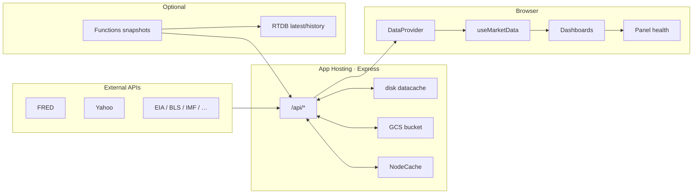
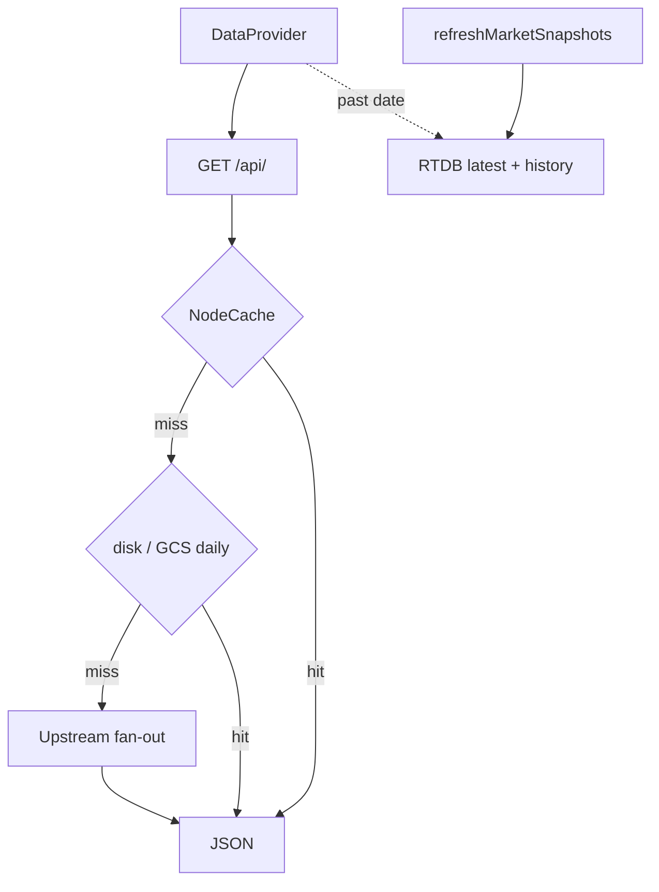

# Data Pipeline

How a number gets from a public API into a panel.

**Last reviewed: 2026-07-30.** Index: [`README.md`](./README.md).

External APIs → **App Hosting Express** (`server/`) → disk/GCS cache →
DataProvider → `useMarketData` → market panel → DataFooter / panel health.

---

## 1. Overview



Historical date picker can read RTDB `history/` when a past date is selected.

---

## 2. External sources (summary)

| Source | Auth | Used by (examples) |
| --- | --- | --- |
| FRED | `FRED_API_KEY` | bonds, fx, credit, sentiment, commodities, real estate, calendar, … |
| Yahoo Finance | none | equities, futures, options, REITs, ETFs |
| EIA / BLS | API keys | eia, bls, commodities energy |
| IMF / World Bank | none | imf, worldbank, macro enrichments |
| CoinGecko, DeFiLlama, CFTC, Treasury, … | mostly none | crypto, sentiment, bonds calendar |

Provenance catalog: `src/hub/dataSources.js` (DataFooter).

---

## 3. Express routes

Mounted in `server/index.js`. Inventory: [`API_ENDPOINTS.md`](API_ENDPOINTS.md).
Align with `src/hub/DataProvider.jsx` and `shared/api-routing.json`.

Typical response shape:

```jsonc
{
  "lastUpdated": "…",
  "fetchedOn": "YYYY-MM-DD",
  "isLive": true,
  "isCurrent": true,
  "_sources": [{ "name": "FRED", "url": "…", "items": "…" }]
}
```

---

## 4. Caching



- **Primary live path:** DataProvider force-fetches App Hosting `/api/*` on load/refresh.
- **RTDB:** nightly/admin snapshots for history and optional seed demos (`VITE_USE_RTDB_SEED`).
- **FRED throttle:** `server/lib/fetch.js` — process-wide sliding window + limited retry on 5xx.
- **GCS:** [`SHARED_CACHE.md`](./SHARED_CACHE.md).

---

## 5. DataProvider & refresh policy

`src/hub/DataProvider.jsx` wave-fetches registered markets (batches of 4, ~250ms gap).
Optional localStorage slim snapshot can paint first; `/api/*` overwrites.

**This is not a real-time streaming app.** Data does not auto-poll after load.

| Trigger | Behavior |
| --- | --- |
| App load | **One** wave, cache-first (serve today's disk/GCS; no `?refresh`) |
| Topbar ▶ | Same full wave with force-live (`?refresh=true` + cache bypass) |
| BentoCard footer ▶ | Force-live for **that market only** (`refetchSingle`) |

No interval auto-refresh. No background revalidate after the first wave.

**Concurrency / reliability**

- One full-wave **mutex** (`fetchPromiseRef`). Concurrent topbar ▶ waiters
  join; any force-live request is drained by the runner (may run a second
  force-live wave, never overlapping waves).
- Panel ▶ uses **per-market serialization** + generation so rapid clicks do not
  apply stale responses out of order.
- Empty primary tabs get **one** cache-first then force-live retry after the
  main wave — only if the client still has no usable data (no re-hit of painted
  markets).
- Failed or empty HTTP bodies **preserve prior payload** (`applyResult`).

| Setting | Typical | Role |
| --- | --- | --- |
| timeout | 120s | Cold FRED fan-outs on App Hosting |
| retries | 1 | Avoid storms |
| batchConcurrency | 4 | Rate-limit friendly (force-live) |
| batchDelayMs | 250 | Smooth bursts |

### Live vs current

- **`isLive`** — payload passes `hasNonNullData` + market `STRUCTURAL_GUARDS`.
- **`isCurrent`** — `fetchedOn === today` (false when serving older cache).

### Federated

| Id | Inputs | Notes |
| --- | --- | --- |
| `alerts` | sentiment, bonds, credit, crypto, commodities, fx | Client rules; no dedicated route |

Some commodities panels also read `sentiment` / `fx` via `useMarketData`.

### Client persistence

1. **localStorage** slim snapshot (idle save).
2. **IndexedDB** full per-market day archive when enabled.

---

## 6. Cross-market reads

Panels may call `useMarketData(otherId)` instead of duplicating backend work
(e.g. commodities COT from sentiment, macro from imf/worldbank). Dependent
panels stay empty until the source market lands.

---

## 7. `useMarketData` + DataFooter

```js
const { data, isLoading, isLive, isCurrent, lastUpdated, fetchedOn, error,
        provenance, refetch } = useMarketData('bonds');
```

Currency conversion is **at render** via `CurrencyContext` where panels need it.
Every panel should expose provenance through DataFooter / MetricValue.

---

## 8. Verification scripts

| Command | Role |
| --- | --- |
| `npm run test:regress` | API shape against live server |
| `npm run test:validate` | Playwright tab/panel crawl |
| `npm run test:audit` | Cache / freshness audit |
| `npm run test:persist` | Bento layout persist |

Default push gate remains `npm run preflight` (Vitest + secrets + workflow lint).

---

## 9. Cache layers (summary)

| Layer | Where | Survives restart |
| --- | --- | --- |
| HTTP Cache-Control | Response headers | n/a |
| NodeCache | Server memory | no |
| Daily JSON | `server/datacache/` (+ GCS) | yes |
| Browser snapshot | localStorage / IndexedDB | yes |

Clear poisoned disk cache: delete `server/datacache/*.json`.

---

## 10. Adding a market

1. Route under `server/routes/`, mount in `server/index.js`.
2. Register in `MARKET_ENDPOINTS` / `shared/api-routing.json`.
3. Structural guard if needed; sources in `dataSources.js`.
4. Tab in `markets.config.js` + market component + `docs/PANELS.md`.
5. Snapshot list in `functions/src/lib/snapshotMarkets.ts` if RTDB should cover it.
6. `npm run preflight` (+ validate if UI-heavy).
